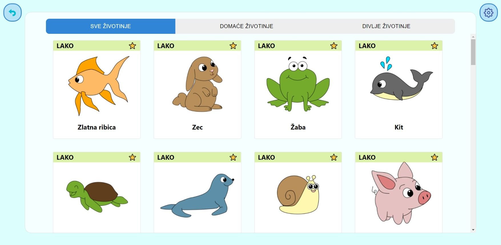

# Coloringbook

Web application made for a school for children and teenagers with disabilities.
The main goal is helping children that have problems with motoric movements by giving them a platform to practice precise movements by coloring animals.
To change the language to English, go to settings.
Technologies: TypeScript, React, Redux, SASS, Firebase

[https://coloringbook-e17d9.web.app/](https://coloringbook-e17d9.web.app/)

## Content
- [Coloringbook](#coloringbook)
  - [Content](#content)
  - [Home page](#home-page)
  - [Select drawing](#select-drawing)
  - [Coloring page](#coloring-page)
  - [Colored image](#colored-image)
  - [Settings](#settings)
  - [Error page](#error-page)
  - [Code Quality](#code-quality)
    - [**Code Quality plugins**](#code-quality-plugins)
    - [**Code Quality scripts**](#code-quality-scripts)
    - [**Pre-commit hooks**](#pre-commit-hooks)

## Home page


## Select drawing



## Coloring page


## Colored image


## Settings


## Error page


## Code Quality

Code quality is ensured by using pre-commit hooks with linter and formatter.

### **Code Quality plugins**

The following plugins for VS Code should be configured out-of-the-box:

ESLint https://marketplace.visualstudio.com/items?itemName=dbaeumer.vscode-eslint<br>
Prettier - Code formatter  https://marketplace.visualstudio.com/items?itemName=esbenp.prettier-vscode

### **Code Quality scripts**
Format the code with Prettier:
```bash
npm run format
```

Run ESLint and report errors and warnings:
```bash
npm run lint
```
Run ESlint and automatically attempt to fix errors and warnings:
```bash
npm run lint-fix
```

### **Pre-commit hooks**

Pre-commit hooks are installed and run using Husky. By doing an npm install husky should automatically set everything up.

To test if the hook will pass before commiting, you can run the linter and formatter on the staged files by using the following command:
```bash
 npx pretty-quick --staged && npx lint-staged
```